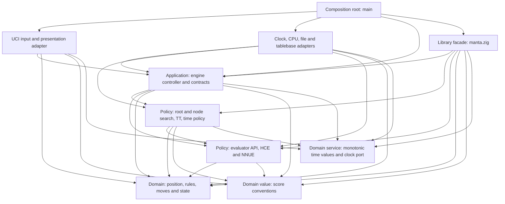
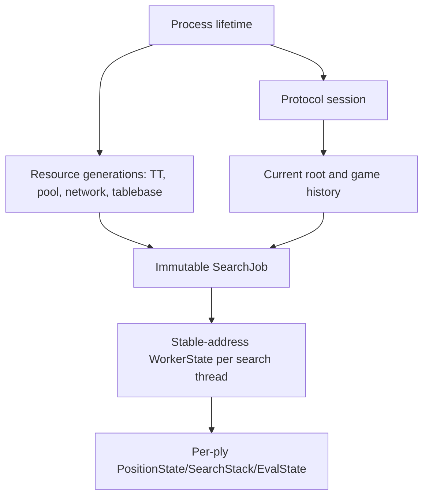

# Manta architecture

This document is the accepted Phase-0.2 architecture for Manta. It defines
dependency direction, ownership, runtime roles, state lifetimes and extension
seams. The accompanying [architecture decision records](docs/adr/README.md)
capture individual decisions and their consequences.

This is architecture, not unrestricted implementation permission. The Phase
0.3 audit passed on 2026-08-07 and opened Phase 1; later phases remain closed
until reached by `PLAN.md`.

## 1. Architectural goals

Manta is optimized for one purpose: becoming the strongest correct chess
engine we can produce in Zig, first at one search thread and then independently
at four search threads. Higher thread counts should scale from sound ownership
and locality, but strength or speed beyond measured configurations is never
assumed.

The architecture shall:

- keep chess rules, search and evaluation independent of UCI, files and the OS;
- express ownership, allocation, error and concurrency explicitly;
- use Zig value types, tagged unions, error unions, optionals, `comptime`
  specialization and precise integer types naturally;
- allow static composition and inlining throughout the hot path;
- put runtime indirection only at coarse external boundaries;
- keep one-thread state local and deterministic while admitting shared SMP
  resources later;
- make the initial HCE replaceable without coupling the position to it;
- prepare factual per-move deltas and evaluator-local state for NNUE;
- make the scalar implementation the semantic oracle for every ISA backend;
- support domain-meaningful tests that detect chess and search defects rather
  than merely preserve current implementation output; and
- defer layout and algorithm choices that require Phase-2 or later evidence.

## 2. Clean Architecture interpretation

Manta uses Clean Architecture as a dependency rule and ownership discipline,
not as a request for classes, virtual interfaces or many layers.



Arrows mean “may import or depend on,” and the graph is the complete permitted
edge set that the Phase-1 dependency lint encodes: an edge that is not drawn is
forbidden, and no edge ever points outward. An inward module never imports an
outer adapter. The composition root is the only place that knows concrete
adapters and complete application assembly; `manta.zig` is the inward-facing
facade that tests, benchmarks and offline tools use instead of `uci`.

The `uci` edges into `chess` and `score` and the `adapters` edge into `chess`
are deliberate. Typed engine events carry domain values rather than
preformatted text, so the presenter needs `chess` notation to write a legal PV
and `score` conversions to write `cp`/`mate`. A tablebase adapter translates
external results into the typed WDL/DTZ probe contract owned by `search` over
`chess` position facts; search policy owns conversion into decisive scores.
This keeps formatting and external probing out of the controller without
granting the adapter an unnecessary dependency on `score`.

Port contracts live with the inward consumer that owns the need:

- engine commands/events, the urgent control handle and the output sink belong
  to `engine`;
- monotonic instants/durations and the clock port belong to the narrow inward
  `time` module used by input, controller and search;
- the tablebase-probe contract belongs to `search`;
- network byte-format contracts belong to `eval`; and
- CPU detection, files, UCI text and external libraries implement those
  contracts from outside.

Runtime function pointers are acceptable for an engine event sink, clock or
optional external probe because calls are coarse, deliberately amortized or
dominated by the external probe itself. Recursive search, move generation,
evaluation and ordinary TT access do not cross a virtual boundary.

## 3. Intended Zig source surface

Phase 1 creates the source tree. The architectural intent is:

| Surface | Responsibility |
|---|---|
| `src/main.zig` | Process composition, allocator and `std.Io` setup, adapter wiring and top-level shutdown |
| `src/manta.zig` | Narrow library facade used by tests, benchmarks and future datagen tools without UCI |
| `src/score.zig` | Score domain type, mate bands and checked conversions shared by search/evaluation/presentation |
| `src/time.zig` | Monotonic instant/duration types, checked arithmetic and the inward clock port shared by input/controller/search |
| `src/chess/` | Precise chess types, position/state, attacks, move generation, make/unmake, notation and hashing |
| `src/eval/` | Evaluator contract, HCE, later NNUE, evaluator-local state and network format |
| `src/search/` | Limits, time policy, root/node search, stacks, histories, TT, tablebase contract and results |
| `src/engine/` | Tagged command/event contracts, options, controller, resource generations and job lifecycle |
| `src/uci/` | Bounded UCI parser and event presenter; no chess/search policy |
| `src/adapters/` | `std.Io`, monotonic clock, CPU features, files, platform threads and external integrations |
| `tools/` | Offline experiment, conversion, data and release tooling |

These are file namespaces under a small number of build modules, not one build
module per class or file. Declarations remain private unless another approved
boundary needs them. Names such as `utils`, `common`, `manager` or `data` are
not used to hide unclear ownership.

Zig-specific rules:

- generic hot components accept a `comptime` type or value and are
  monomorphized;
- runtime alternatives use `union(enum)` and switch once at the boundary;
- public functions use concrete domain types and narrow inferred error sets;
- packed/extern layouts are reserved for atomic words, foreign ABI and file
  formats, not ordinary in-memory modeling;
- allocators are explicit at every owning initialization and mutation point;
- containers follow Zig 0.16's unmanaged-style API, receiving an allocator at
  the owning operation rather than finding a global allocator;
- `std.Io` readers, writers, clocks and filesystem operations remain in outer
  adapters; and
- CPU-bound search workers use an explicitly owned persistent thread pool, not
  asynchronous I/O tasks.

## 4. Runtime and control flow

```mermaid
sequenceDiagram
    participant Input as UCI input task
    participant Mailbox as Bounded control mailbox
    participant Control as EngineControl handle
    participant Controller as Engine controller
    participant Worker as Search worker(s)
    participant Sink as Bounded engine event sink
    participant Presenter as UCI presenter task/stdout

    Input->>Input: Read bounded line and timestamp receipt
    Input->>Control: Urgent epoch-tagged stop/quit/ponder signal
    Input->>Mailbox: Parsed tagged command + epoch
    Mailbox->>Controller: Ordered command
    Controller->>Worker: Immutable SearchJob + Control view
    Worker->>Controller: Coalescible info or bounded completion slot
    Controller->>Sink: Typed EngineEvent
    Sink->>Presenter: Non-blocking offer; coalesce info
    Presenter->>Presenter: Format and write one complete UCI line
```

The logical roles are:

| Role | Ownership and restrictions |
|---|---|
| Input task | Owns its bounded read/parse buffer. It performs syntax parsing, timestamps complete `go` receipt, calls the engine-owned urgent-control handle **before** transferring owned command payloads, and only then queues the ordered command. Publishing urgent state first is what keeps `stop`/`quit` responsive when the ordinary mailbox is applying backpressure. |
| Engine controller | Sole mutable owner of current root position, options, resource generations and active-job lifecycle. It knows typed commands/events, not UCI text or stdout. |
| Engine control | Controller-owned atomics/epoch observed through narrow command and worker views. The UCI adapter can request urgent control but cannot access workers. |
| Search worker | Owns mutable position, per-ply/search/evaluator state, histories, move buffers and local counters. It observes only the narrow control view and never parses commands, changes global options or formats output. |
| Engine event sink | Coarse inward-owned non-blocking offer port called only by the controller. Tests use a recorder; production uses a bounded output mailbox with coalescible info and non-droppable completion handling. |
| UCI presenter task | Sole stdout writer. It drains typed events, converts them into complete protocol lines and contains no engine policy. A blocked stdout cannot block the controller from processing urgent control. |

`Threads = 1` means one CPU search worker. The input/controller/presenter
support roles are not counted as search threads. This preserves responsive
`stop`, `quit`, EOF and `isready` handling without putting I/O into search.

The search epoch is owned by the controller and identifies one active job. The
input task reads the current epoch through `EngineControl`; it never mints one.
A `stop`, `quit` or `ponderhit` therefore always refers to the search that was
active when its line was read, and a completion from a superseded job is
rejected by comparing against the controller's own active epoch. Whether an
additional monotonic command sequence number is also needed to order ordinary
mailbox traffic is a Phase-1 decision, and it is a distinct concept from the
search epoch even if one counter can serve both.

The control mailbox is bounded. Ordinary commands preserve FIFO order and may
apply backpressure while the independently running controller drains them.
Urgent stop/quit/ponder state is published immediately through `EngineControl`
with the active search epoch once its line is read. The output mailbox may
coalesce obsolete search info. Its offer operation never blocks the controller:
if a completion cannot transfer immediately, the controller retains it as its
single pending critical event, does not start another search, continues to
service commands/control and retries after presenter progress. Completion is
therefore bounded and non-droppable without making stdout part of controller
progress. Concrete mailbox primitives and capacities are Phase-1 decisions
verified by process tests.

The worker return path is also bounded. Progress snapshots may be overwritten
or coalesced, while each active worker/job has one owned completion slot or an
equivalent joined-result path. A worker never waits for UCI presentation, and
completion storage cannot grow with search depth, node count or output rate.

The controller accepts a completion only when its epoch matches the active job
and it has not already published completion. Resource changes stop and join the
active job before installing a new generation.

## 5. Ownership and lifetimes



| Lifetime | Owner | Allocation rule |
|---|---|---|
| Process | Composition root | Selects the concrete general allocator and `std.Io`; calls every `deinit` in reverse ownership order. |
| Protocol session | UCI adapter and controller | Bounded input/output scratch and command payloads; payload ownership transfers once and is freed after consumption. |
| Resource generation | Controller | TT, worker pool, loaded network and tablebase handle are complete before publication and replaced only while workers are joined. |
| Search job | Controller until completion | Immutable root snapshot, limits, options, epoch, timestamps and borrowed references to resources that outlive the joined job. |
| Worker | Worker pool | One stable-address, aligned allocation per worker created/resized outside search. |
| Ply | Worker | Fixed-capacity arrays indexed within `MAX_PLY` plus explicit padding; no heap ownership. |

“Fixed-capacity worker state” does not mean putting large arrays on the OS
thread stack. Position states, move buffers, PV storage, histories and future
NNUE accumulators are inline within a preallocated worker object at a stable
heap address. Recursive function frames stay small. Thread stack size and a
maximum-ply search are tested explicitly.

The hot chess/search APIs accept no allocator. TT, network, tablebase and pool
reconfiguration are transactional: stop and join active workers first, retain
the old generation while constructing and validating its replacement, swap
ownership, then destroy the old generation. Potentially blocking file work is
performed by an outer cancellable adapter operation rather than by an active
search worker; Phase 1 freezes whether the controller awaits it while idle or
receives a typed completion from an adapter task.

## 6. Position and state

The architecture separates four concepts:

```text
PhysicalPosition
  piece placement and selected redundant board representation

PositionState (one per ply)
  reversible rule state, keys, cached king geometry, captured piece,
  repetition/null information and factual dirty-piece delta

GameHistory
  dynamically owned pre-search history needed for repetition semantics

EvaluatorState (one stack per worker)
  HCE incremental state or NNUE accumulators/refresh caches
```

Search workers own the mutable physical position and caller-supplied per-ply
state storage. `makeMove` writes the child state supplied by the caller and
updates physical placement; `unmakeMove` reverses physical placement and
restores the previous state without allocation, copying the full position or
recomputing unrelated history. Null moves have a distinct internal contract.

External/UCI move application uses a checked, transactional API. Hot-path move
application has documented preconditions and Debug/ReleaseSafe assertions; it
does not return broad recoverable errors for states already proven by move
generation.

The current-state link may be a checked index/cursor or a pointer into
stable-address worker storage. Phase 2 chooses it together with the board
representation using correctness, copy safety, state size, generated code and
full-search performance. It is not frozen prematurely.

The board representation ADR freezes candidate criteria, not a winner. The
selected representation may deliberately duplicate mailbox, piece bitboards,
occupancy, king squares or counts where measurements show that redundancy
improves complete engine performance. Cached state is factual chess state, not
HCE-specific feature storage.

## 7. Evaluator composition

The evaluator contract is a Zig structural compile-time contract: concrete
types provide the required operations and state types, and compile-time checks
produce a clear error when the contract is incomplete.

The engine chooses the active evaluator once before recursive search:

```text
runtime evaluator choice
  -> switch once
  -> monomorphized rootSearch(Hce)
     or monomorphized rootSearch(Nnue)
  -> statically dispatched recursive evaluation
```

Persistent workers hold a tagged union of concrete evaluator states. The root
switch activates the matching state and passes its concrete pointer to the
specialized search. There is no evaluator vtable or tagged-union switch at
every node.

The chess domain emits factual dirty-piece deltas. Each evaluator decides how
to consume them lazily or incrementally. HCE parameters, NNUE accumulators,
network scratch and evaluation traces never become fields of the physical
position. A diagnostic evaluator build can be composed with a compile-time
diagnostic sink; the production no-op sink compiles away.

## 8. Search composition

Search is organized by concrete state and functions rather than strategy
objects:

| Type | Purpose |
|---|---|
| `SearchJob` | Immutable root snapshot, limits, options, timestamps, epoch and stable resource references |
| `RootSearch` | Iterative deepening, aspiration, legal root set, MultiPV seam, completed-iteration ownership and final result |
| `ThreadState` | Worker-local position, stacks, histories, evaluator state, nodes and diagnostics |
| `SharedSearch` | Cancellation/ponder state, shared TT, root publication and batched aggregate counters |
| `SearchStack` | Per-ply current move, killers/context, static evaluation and explicit evidence needed by consumers |
| `CompletedIteration` | Legal PV, score/bound, depth, selective depth, effort and timing from one completed root iteration |
| `SearchResult` | Legal final move/PV, score, termination reason and exactly-once publication identity |

Root, PV and non-PV node types are compile-time modes where specialization
improves clarity and generated code. Heuristics are cohesive functions over
the state they need. There is no heap-allocated policy graph and no interface
per pruning mechanism.

Score provenance is explicit at consumer boundaries: terminal, tablebase,
static, lower-bound, upper-bound and exact evidence are not treated as
interchangeable merely because each carries an integer. The implementation may
use compact tagged values, compile-time node modes or proven local invariants;
it shall not pay for a large runtime object at every node.

One-thread behavior is the semantic baseline. With `Threads = 1`, SMP-only
jitter, helper voting and aggregate-limit behavior are absent or provably
inert. Four-thread correctness, time safety, playing strength and scaling are
separate gates. Worker node counters stay local and publish in batches rather
than contending on one atomic at every node.

## 9. Transposition table

The TT is an internal search data structure, not an external repository port.
Direct static access from search is intentional because probe/store are among
the hottest operations.

The accepted concurrency contract is:

- one shared semantic layout and replacement policy for 1T and SMP;
- cache-aligned fixed-size clusters allocated outside search;
- lock-free probe/store using target-supported atomic integer words;
- no C/C++-style benign data races or undefined behavior;
- a racing or incomplete read may be treated as a miss;
- a read shall never combine unvalidated words into a trusted hit;
- every retrieved move is position-validated before use;
- mate score normalization is centralized and round-trip tested;
- generation/clear semantics are explicit and deterministic at 1T;
- resize happens only after workers join and publishes a fully allocated table;
  and
- TT contents are never persisted between processes.

The exact cluster size, bit packing, key validation and replacement constants
belong to Phase 4. The design shall not require non-lock-free 128-bit atomics.
A later non-atomic 1T storage specialization is permitted only if it shares the
same encoding/replacement semantics, preserves fingerprints and wins controlled
native performance evidence.

## 10. Time and cancellation

The search clock is an inward-owned coarse port backed by Zig's explicit
`std.Io` monotonic clock in production and a deterministic fake in tests.
Timestamps are opaque monotonic nanoseconds; UCI milliseconds are converted at
the boundary with checked/saturating duration arithmetic.

The input adapter captures the `go` receipt timestamp before queueing. A pure
time-policy function derives soft/hard budgets and absolute deadlines from the
job snapshot. Search polls cancellation and time at an adjustable node interval,
not on every node. Ponder transition updates the active job under the epoch
contract without restarting already spent time.

Phase 4 supplies a conservative deterministic 1T policy for `movetime` and
ordinary clock/increment/moves-to-go inputs before any strength gate is allowed.
It includes receipt-based accounting, explicit overhead, a hard deadline and a
legal completed fallback. Phase 6 may improve soft allocation, root-confidence
use, ponder behaviour and SMP coordination, but it preserves those accounting
and safety semantics.

Cancellation state distinguishes stop, quit and ponderhit. Publishing uses the
minimum memory ordering justified by an ADR/code comment and cross-architecture
tests; “relaxed everywhere” is not an architectural assumption.

## 11. ISA backends

The scalar path is always compiled and is the semantic oracle. CPU feature
detection is an adapter invoked at startup. The controller selects a supported
backend before search or evaluator entry; a forced unsupported backend is
rejected without disabling the scalar fallback.

Static specialization is preferred for small hot kernels when code size is
reasonable. A measured indirect call is acceptable for a sufficiently heavy
kernel. The dispatch point is never hidden inside every bitboard operation.
Native builds may compile directly for the host; portable releases either
contain runtime-selected siblings or use accurately named assets. Phase 10
chooses the exact mechanism from stable-Zig capabilities, generated code and
native evidence.

Optimized backends implement the same integer contract as scalar code. Backend
identity, required CPU features and build flags are one manifest-visible
contract.

## 12. Persisted formats and external resources

Manta-defined binary files are canonical little-endian and contain:

- magic and schema version;
- header and payload lengths;
- format-specific dimensions/feature identifiers;
- quantization or encoding metadata where applicable; and
- an integrity hash or checksum sufficient to reject truncation/corruption.

Networks and high-volume datasets use binary payloads. Human-readable
experiment/release manifests use versioned UTF-8 JSON. Standard text formats
retain strict, named parser profiles rather than being wrapped in a proprietary
container.

Unknown versions, inconsistent dimensions, trailing data where forbidden and
truncated/corrupt payloads are rejected transactionally. Legacy conversion is
offline tooling; the engine does not accumulate in-place migration branches.
The engine has no persisted TT and no general configuration file initially.

Optional resources load through adapters outside the hot path. A validated
replacement becomes visible only while search is idle; failure retains the
last valid resource.

## 13. Error flow

Errors follow ownership and are never converted to strings inside core policy:

| Boundary | Contract |
|---|---|
| UCI/text to engine command | Syntax/size errors are bounded adapter diagnostics; no partially parsed command enters the controller. |
| FEN/move to chess state | Checked domain errors reject the complete transaction and preserve the prior valid position/history. |
| Resource construction | Allocation, file, network/tablebase and format errors return a typed failure; the controller retains the prior generation. |
| Controller to search worker | Job creation validates all recoverable inputs first. A worker publishes typed completion/termination; it does not log or format. |
| Search hot path | Generated/legal-state preconditions are asserted in safety builds. An impossible internal invariant is fatal rather than a recoverable `anyerror` branch at every node. |
| Engine event to presenter | The controller emits typed diagnostics/events. The presenter alone chooses UCI text or stderr detail. |
| Process I/O | Input EOF is orderly shutdown. Presenter I/O must be interruptible by process shutdown; unrecoverable stdout/OS initialization failure cancels/joins owned work and exits non-zero. |
| Foreign adapter | Foreign status/errno is translated to a narrow Manta error before crossing inward; foreign pointers never escape their owner. |

Public/internal APIs use narrow inferred or named error sets. External input,
allocation and file failures are never handled with `catch unreachable`.
Thread entry points catch their Zig error union and convert it to a typed worker
completion because an error cannot unwind across an OS-thread boundary.
Diagnostics carry bounded structured context; sensitive or platform-specific
detail remains on stderr.

## 14. Feature pressure test

| Future capability | Architectural seam and pressure |
|---|---|
| NNUE | Factual dirty-piece deltas, evaluator-local accumulator stack, transactional immutable network and statically specialized evaluation |
| SMP | Stable worker ownership, shared-search boundary, atomic TT, batched counters, epoch cancellation and one-thread inertness |
| NUMA | Resource-generation owner can later allocate worker groups and TT shards by topology without changing chess/search APIs |
| Tablebases | Inward typed WDL/DTZ probe contract, external file/library adapter and root/interior policy in search |
| Chess960 | Castling facts/rules remain centralized in chess state and move application; no assumptions scattered through search/evaluation |
| MultiPV | Root search owns legal root candidates and completed lines; recursive search does not depend on presentation count |
| Datagen | `manta.zig` facade exposes engine/chess use cases without starting UCI or stdout |
| Diagnostics | Compile-time sink/counter specialization plus typed events; production no-op code is removable |
| Additional ISAs | Scalar contract, startup capability registry and coarse static/runtime backend selection |
| New HCE | Evaluator-local features/parameters behind the same factual position and score contract |

This pressure test requires seams, not placeholder implementations. Only
standard chess, HCE and one-thread search are built in their owning initial
phases.

## 15. Domain-meaningful verification

Tests are engineering evidence, not implementation preservation. Every
non-trivial test or suite shall name the chess rule, search invariant, protocol
contract, ownership property or performance risk it protects.

Preferred independent evidence includes:

- legal-rule oracles, perft and independently derived terminal outcomes;
- randomized make/unmake and full-state recomputation;
- metamorphic properties with explicit chess preconditions and exceptions;
- mate-distance ordering, legal PVs and completed-root ownership;
- equivalent-result checks with TT, pruning or backend features toggled;
- adversarial draw, castling, promotion, en-passant and rule-50 histories;
- allocation, bounds, concurrency and cancellation instrumentation;
- domain-realistic benchmarks and complete-search profiles; and
- registered 1T and 4T games for strength claims.

An exact current evaluation, node total, structure size or tuning constant is
not automatically truth. It is asserted only when it is an intentional
contract, conformance snapshot or diagnostic fingerprint, with the reason and
update procedure recorded. Tests shall not duplicate the production algorithm
and call that an independent oracle.

Coding work must trace the producer, transformation and consumers of changed
evidence; consider legal chess semantics, tactical/search consequences,
throughput, cache/thread behavior and likely playing-strength impact; and
separate correctness proof from empirical strength. Passing tests is necessary
but never sufficient evidence that a playing change improves the engine.

## 16. Architecture-fitness and zero-cost checks

Phase 1 and later shall make these checks executable as their subjects exist:

| Check | Failure caught |
|---|---|
| Import/dependency scan | Core importing UCI, filesystem, OS threads or concrete external adapters; cycles or forbidden lateral edges |
| Public-surface scan | Accidental broad `pub`, generic junk drawers or unowned cross-layer types |
| Allocation instrumentation | Any node/move/evaluate/TT hot-path allocation or unbounded command/resource growth |
| Compile-time size/alignment assertions | State, move, TT, cache-line and atomic assumptions drifting silently |
| Maximum-ply/thread-stack test | Out-of-bounds state access, oversized recursive frames and inadequate worker stack |
| Evaluator/backend conformance | Runtime specialization changing scalar/HCE/NNUE semantics |
| One-thread inertness | SMP-capable build changing `Threads = 1` fingerprint or options unexpectedly |
| Disassembly/symbol inspection | Indirect evaluator calls, allocator/I/O calls or unintended ISA in baseline hot paths |
| Process/race tests | Duplicate bestmove, stale epoch, output interleaving, deadlock and resource swap during active search |
| File corruption matrix | Accepting unknown, truncated, wrong-endian or dimensionally incompatible persisted data |
| Requirement/test trace | A requirement or ADR having no feasible test, check or evidence owner |

No numeric layout threshold is invented in Phase 0. Phase 2 records correct
baseline sizes and performance, then turns approved budgets into assertions.

## 17. Deliberately deferred choices

The following remain open until their evidence phase:

- mailbox/bitboard/piece-list representation and current-state pointer/index;
- move encoding, move-list layout and staged-generation buffer shape;
- sliding-attack algorithm and lookup layout;
- exact position/state/undo byte layout and cache budgets;
- TT cluster packing, replacement constants and optional 1T storage policy;
- mailbox primitive and scheduling implementation;
- HCE internal composition details and all NNUE architecture choices;
- SMP search algorithm, helper voting and NUMA topology policy;
- runtime multiversioning versus sibling ISA assets;
- GNU, libc-free or static-musl Linux packaging; and
- PGO/LTO and compiler-specific performance techniques.

Deferral is intentional: the architecture provides ownership and test seams
without pretending that unmeasured low-level choices are already known.

## 18. Decision index

The accepted decisions are indexed in [docs/adr/README.md](docs/adr/README.md).
The Phase-0.3 exit verdict is recorded in `PLAN.md`. Later changes supersede an
ADR rather than silently editing the historical decision.

Authoritative language references for this architecture are the
[Zig 0.16.0 documentation](https://ziglang.org/documentation/0.16.0/) and
[release notes](https://ziglang.org/download/0.16.0/release-notes.html).
