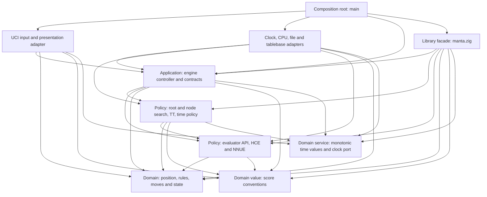
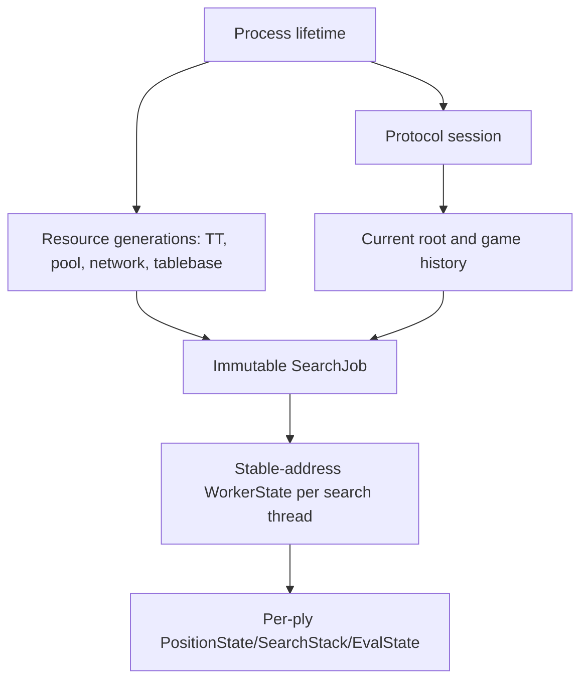

# Manta architecture

This document is the accepted Phase-0.2 architecture for Manta. It defines
dependency direction, ownership, runtime roles, state lifetimes and extension
seams. The accompanying [architecture decision records](docs/adr/README.md)
capture individual decisions and their consequences.

The text adapter and controller must implement the separately frozen
[UCI behavioral contract](docs/UCI.md); this architecture owns dependency and
runtime structure, while that contract owns observable protocol behavior.

This is architecture, not unrestricted implementation permission. The Phase
0.3 audit passed on 2026-08-07 and opened Phase 1; later phases remain closed
until reached by `PLAN.md`.

## 1. Architectural goals

Manta is optimized for one purpose: becoming the strongest correct chess
engine we can produce in Zig, first at one search thread and then independently
at four search threads. Four threads are the first formal SMP strength scope,
not an endpoint; higher thread counts should scale from sound ownership
and locality, but strength or speed beyond measured configurations is never
assumed.

The architecture shall:

- keep chess rules, search and evaluation independent of UCI, files and the OS;
- express ownership, allocation, error and concurrency explicitly;
- use Zig value types, tagged unions, error unions, optionals, `comptime`
  specialization and precise integer types naturally;
- allow static composition and inlining throughout the hot path;
- put runtime indirection only at coarse external boundaries;
- keep one-thread state local and deterministic while admitting shared SMP
  resources later;
- make the initial HCE replaceable without coupling the position to it;
- prepare factual per-move deltas and evaluator-local state for NNUE;
- make the scalar implementation the semantic oracle for every ISA backend;
- support domain-meaningful tests that detect chess and search defects rather
  than merely preserve current implementation output; and
- defer layout and algorithm choices that require Phase-2 or later evidence.

## 2. Clean Architecture interpretation

Manta uses Clean Architecture as a dependency rule and ownership discipline,
not as a request for classes, virtual interfaces or many layers.



Arrows mean “may import or depend on,” and the graph is the complete permitted
edge set that the Phase-1 dependency lint encodes: an edge that is not drawn is
forbidden, and no edge ever points outward. An inward module never imports an
outer adapter. The composition root is the only place that knows concrete
adapters and complete application assembly; `manta.zig` is the inward-facing
facade that tests, benchmarks and offline tools use instead of `uci`.

The `uci` edges into `chess` and `score` and the `adapters` edge into `chess`
are deliberate. Typed engine events carry domain values rather than
preformatted text, so the presenter needs `chess` notation to write a legal PV
and `score` conversions to write `cp`/`mate`. A tablebase adapter translates
external results into the typed WDL/DTZ probe contract owned by `search` over
`chess` position facts; search policy owns conversion into decisive scores.
This keeps formatting and external probing out of the controller without
granting the adapter an unnecessary dependency on `score`.

Port contracts live with the inward consumer that owns the need:

- engine commands/events, the urgent control handle and the output sink belong
  to `engine`;
- monotonic instants/durations and the clock port belong to the narrow inward
  `time` module used by input, controller and search;
- the tablebase-probe contract belongs to `search`;
- network byte-format contracts belong to `eval`; and
- CPU detection, files, UCI text and external libraries implement those
  contracts from outside.

Runtime function pointers are acceptable for an engine event sink, clock or
optional external probe because calls are coarse, deliberately amortized or
dominated by the external probe itself. Recursive search, move generation,
evaluation and ordinary TT access do not cross a virtual boundary.

## 3. Intended Zig source surface

Phase 1 creates the source tree. The architectural intent is:

| Surface | Responsibility |
|---|---|
| `src/main.zig` | Process composition, allocator and `std.Io` setup, adapter wiring and top-level shutdown |
| `src/manta.zig` | Narrow library facade used by tests, benchmarks and future datagen tools without UCI |
| `src/score.zig` | Score domain type, mate bands and checked conversions shared by search/evaluation/presentation |
| `src/engine/time.zig` | Pure one-thread budget/deadline policy and injected monotonic clock control shared by controller/search |
| `src/chess/` | Precise chess types, position/state, attacks, move generation, make/unmake, notation and hashing |
| `src/eval/` | Evaluator contract, HCE, later NNUE, evaluator-local state and network format |
| `src/search/` | Limits, time policy, root/node search, stacks, histories, TT, tablebase contract and results |
| `src/engine/` | Tagged command/event contracts, options, controller, resource generations and job lifecycle |
| `src/uci/` | Bounded UCI parser and event presenter; no chess/search policy |
| `src/adapters/` | `std.Io`, monotonic clock, CPU features, files, platform threads and external integrations |
| `tools/` | Offline experiment, conversion, data and release tooling |

These are file namespaces under a small number of build modules, not one build
module per class or file. Declarations remain private unless another approved
boundary needs them. Names such as `utils`, `common`, `manager` or `data` are
not used to hide unclear ownership.

Zig-specific rules:

- generic hot components accept a `comptime` type or value and are
  monomorphized;
- runtime alternatives use `union(enum)` and switch once at the boundary;
- public functions use concrete domain types and narrow inferred error sets;
- packed/extern layouts are reserved for atomic words, foreign ABI and file
  formats, not ordinary in-memory modeling;
- allocators are explicit at every owning initialization and mutation point;
- containers follow Zig 0.16's unmanaged-style API, receiving an allocator at
  the owning operation rather than finding a global allocator;
- `std.Io` readers, writers, clocks and filesystem operations remain in outer
  adapters; and
- CPU-bound search workers use an explicitly owned persistent thread pool, not
  asynchronous I/O tasks.

## 4. Runtime and control flow

```mermaid
sequenceDiagram
    participant Input as UCI input task
    participant Mailbox as Bounded control mailbox
    participant Control as EngineControl handle
    participant Controller as Engine controller
    participant Worker as Search worker(s)
    participant Sink as Bounded engine event sink
    participant Presenter as UCI presenter task/stdout

    Input->>Input: Read bounded line and timestamp receipt
    Input->>Control: Urgent epoch-tagged stop/quit/ponder signal
    Input->>Mailbox: Parsed tagged command + epoch
    Mailbox->>Controller: Ordered command
    Controller->>Worker: Immutable SearchJob + Control view
    Worker->>Controller: Coalescible info or bounded completion slot
    Controller->>Sink: Typed EngineEvent
    Sink->>Presenter: Non-blocking offer; coalesce info
    Presenter->>Presenter: Format and write one complete UCI line
```

The logical roles are:

| Role | Ownership and restrictions |
|---|---|
| Input task | Owns its bounded read/parse buffer. It performs syntax parsing, timestamps complete `go` receipt, calls the engine-owned urgent-control handle **before** transferring owned command payloads, and only then queues the ordered command. Publishing urgent state first is what keeps `stop`/`quit` responsive when the ordinary mailbox is applying backpressure. |
| Engine controller | Sole mutable owner of current root position, options, resource generations and active-job lifecycle. It knows typed commands/events, not UCI text or stdout. |
| Engine control | Controller-owned atomics/epoch observed through narrow command and worker views. The UCI adapter can request urgent control but cannot access workers. |
| Search worker | Owns mutable position, per-ply/search/evaluator state, histories, move buffers and local counters. It observes only the narrow control view and never parses commands, changes global options or formats output. |
| Engine event sink | Coarse inward-owned non-blocking offer port called only by the controller. Tests use a recorder; production uses a bounded output mailbox with coalescible info and non-droppable completion handling. |
| UCI presenter task | Sole stdout writer. It drains typed events, converts them into complete protocol lines and contains no engine policy. A blocked stdout cannot block the controller from processing urgent control. |

Quiet history is part of that worker-local search state. The accepted 288-KiB
reply table keys the immediately previous resulting piece/destination against
the current quiet piece/destination after color-symmetric square normalization.
MAN-S17 adds a 1.125-MiB multi-distance continuation table with historical
check/tactical context. Both are cleared with other ordering state, never
shared or persisted, and add no allocation, I/O, lock or atomic access. Later
SMP work must preserve per-worker ownership and account for the complete
sub-1.5-MiB ordering state before choosing any sharing or merge policy.

`Threads = 1` means one CPU search worker. The input/controller/presenter
support roles are not counted as search threads. This preserves responsive
`stop`, `quit`, EOF and `isready` handling without putting I/O into search.

The search epoch is owned by the controller and identifies one active job. The
input task reads the current epoch through `EngineControl`; it never mints one.
The urgent atomic side of `stop`, `quit` or `ponderhit` therefore refers only to
the search active when its line was read. Its queued copy retains FIFO command
authority: if it follows a queued replacement `go`, it applies to the
replacement after that command is processed. A superseded epoch cannot leak
urgent state into the replacement.

The control mailbox is bounded. Ordinary commands preserve FIFO order and may
apply backpressure while the independently running controller drains them.
Urgent stop/quit/ponder state is published immediately through `EngineControl`
with the active search epoch once its line is read. The output mailbox may
coalesce or drop obsolete search info. Required lines apply bounded
backpressure to the controller, but never to a search worker; the input task
still applies urgent epoch-scoped stop/quit state immediately, and shutdown
closes the output queue to release a waiting controller. A completed result
remains in its single joined slot until its required output transfers, and the
controller does not start another search first. Completion is therefore
bounded and non-droppable. Concrete mailbox primitives and capacities are
Phase-1 decisions verified by process tests.

The worker return path is also bounded. Progress snapshots may be overwritten
or coalesced, while each active worker/job has one owned completion slot or an
equivalent joined-result path. A worker never waits for UCI presentation, and
completion storage cannot grow with search depth, node count or output rate.

The controller accepts a completion only when its epoch matches the active job
and it has not already published completion. Resource changes stop and join the
active job before installing a new generation.

Phase 1 fixes both the command and output mailboxes at 64 records. A formatted
output record is at most 4,096 bytes, while an input command is derived from a
line of at most 65,536 bytes and retains only bounded parsed/sanitized fields.
The shell uses separate Zig `std.Io` input, controller and presenter tasks. Its
live-search progress offer never waits and may be dropped when the presenter
queue is full. Required protocol lines wait for bounded presenter capacity;
urgent stop/quit state is still applied independently by the input task, and
shutdown closes the queue to release a blocked producer. Step 6.1 adds one
worker-to-controller coalesced progress slot and a separate joined completion
result; completion and required `bestmove` are never stored in the droppable
slot. The fixed mailbox capacities are unchanged.

## 5. Ownership and lifetimes



| Lifetime | Owner | Allocation rule |
|---|---|---|
| Process | Composition root | Selects the concrete general allocator and `std.Io`; calls every `deinit` in reverse ownership order. |
| Protocol session | UCI adapter and controller | Bounded input/output scratch and command payloads; payload ownership transfers once and is freed after consumption. |
| Resource generation | Controller | TT, worker pool, loaded network and tablebase handle are complete before publication and replaced only while workers are joined. |
| Search job | Controller until completion | Immutable root snapshot, limits, options, epoch, timestamps and borrowed references to resources that outlive the joined job. |
| Worker | Worker pool | One stable-address, aligned allocation per worker created/resized outside search. |
| Ply | Worker | Fixed-capacity arrays indexed within `MAX_PLY` plus explicit padding; no heap ownership. |

“Fixed-capacity worker state” does not mean putting large arrays on the OS
thread stack. Position states, move buffers, PV storage, histories and future
NNUE accumulators are inline within a preallocated worker object at a stable
heap address. Recursive function frames stay small. Thread stack size and a
maximum-ply search are tested explicitly.

The hot chess/search APIs accept no allocator. TT, network, tablebase and pool
reconfiguration are transactional: stop and join active workers first, retain
the old generation while constructing and validating its replacement, swap
ownership, then destroy the old generation. Potentially blocking file work is
performed by an outer cancellable adapter operation rather than by an active
search worker; Phase 1 freezes whether the controller awaits it while idle or
receives a typed completion from an adapter task.

## 6. Position and state

The architecture separates four concepts:

```text
PhysicalPosition
  64-square mailbox, piece-type bitboards, color occupancy and piece counts

PositionState (one per ply)
  reversible rule state, keys, cached king geometry, captured piece,
  repetition/null information and factual dirty-piece delta

GameHistory
  dynamically owned pre-search history needed for repetition semantics

EvaluatorState (one stack per worker)
  HCE incremental state or NNUE accumulators/refresh caches
```

Search workers own the mutable physical position and caller-supplied per-ply
state storage. `makeMove` writes the child state supplied by the caller and
updates physical placement; `unmakeMove` reverses physical placement and
restores the previous state without allocation, copying the full position or
recomputing unrelated history. Null moves have a distinct internal contract.

External/UCI move application uses a checked, transactional API. Hot-path move
application has documented preconditions and Debug/ReleaseSafe assertions; it
does not return broad recoverable errors for states already proven by move
generation.

Checked standard-FEN setup is transactional and allocation-free: it constructs
a temporary mailbox, reconstructs all redundant physical and derived facts,
normalizes only harmless stale castling/en-passant identity and commits the
caller-owned root state after complete validation. Canonical serialization
writes into caller-provided bounded storage.

The current-state link is a pointer into stable-address caller-owned storage.
Position/root copies explicitly rebind it. The selected hybrid representation
deliberately duplicates mailbox, piece-type bitboards, color occupancy and
piece counts so piece lookup and set operations are both constant-time. Only
factual checkers are cached initially; other derived geometry must earn its
footprint in complete-search measurement. Cached state is factual chess state,
not HCE-specific feature storage. ADR-0013 owns the exact representation,
move, attack-data and initial layout contracts.

Manta supports only 64-bit x86-64 and ARM64. Hot, process-local structures may
use pointer-width `usize` counters and rely on 64-bit pointer/alignment shape;
there is no parallel 32-bit layout or compatibility shim. Persisted files and
protocol values remain explicitly sized and are never raw dumps of these
native structures. ADR-0014 records this boundary and the post-benchmark board
specializations it enables.

## 7. Evaluator composition

The evaluator contract is a Zig structural compile-time contract: concrete
types provide the required operations and state types, and compile-time checks
produce a clear error when the contract is incomplete.

`src/score.zig` owns one four-byte strong search score over `i32`. Ordinary
evaluation uses the stable 100-units-per-pawn search/cp scale and is limited to
magnitude 31,487. Magnitudes 31,488–31,743 are reserved for future tablebase
distance, 31,744–32,000 are mate scores, 32,001 is the search bound and 32,002
is the non-arithmetic `NONE` sentinel. Evaluators with a different internal
scale convert explicitly before returning a score. Static evaluators do not
produce terminal, history-draw or tablebase evidence; search owns those facts
and their provenance.

The engine chooses the active evaluator once before recursive search:

```text
runtime evaluator choice
  -> switch once
  -> monomorphized rootSearch(Hce)
     or monomorphized rootSearch(Nnue)
  -> statically dispatched recursive evaluation
```

Persistent workers hold a tagged union of concrete evaluator states. The root
switch activates the matching state and passes its concrete pointer to the
specialized search. There is no evaluator vtable or tagged-union switch at
every node.

The chess domain emits factual dirty-piece deltas. Each evaluator decides how
to consume them lazily or incrementally. HCE parameters, NNUE accumulators,
network scratch and evaluation traces never become fields of the physical
position. A diagnostic evaluator build can be composed with a compile-time
diagnostic sink; the production no-op sink compiles away.

The search-facing binding exposes `refresh`, directional `update` and
`evaluate` over concrete evaluator and worker-state types. Forward and backward
updates use the same child-state `MoveDelta`; the position argument is the
post-transition position. Null moves carry no piece changes but still reverse
the side-to-move perspective. The evaluator declares its trace-entry type;
bounded caller-owned trace buffers may truncate diagnostics, never evaluation.
Trace-disabled and trace-enabled specializations return the exact same score.
The same binding exposes evaluator-owned `see_values` to the board's generic
SEE service. This gives ordering a stable, statically selected exchange scale
without importing HCE parameters into search or making SEE an evaluator cache.

Tapered HCE values use a convex middlegame/endgame phase blend with division
toward zero, preserving color antisymmetry. Material phase above the nominal
opening total is clamped because legal promotion can create additional
non-pawn material. The evaluator owns the future material-to-phase mapping;
the boundary owns only these interpolation semantics.

The HCE remains a scalar full-refresh implementation over authoritative board
facts. ADR-0052 adds one bounded worker-local pawn cache after Step 5.3.10 made
pawn-only work grow again and measurement justified the retry. It is exact
memoization under a complete pawn-key tag, not incremental evaluation state;
collisions recompute and the scalar full-refresh calculation remains the
oracle. A frozen one-time parameter snapshot supplies
material/PST, basic pawn, activity and pawn-threat terms; four stable component
traces plus phase and total form the conformance surface. Static evaluation
does not damp or override results from rule history, dead-position, terminal,
tablebase or specialized endgame evidence. ADR-0016 owns the exact bootstrap
scope, reference hashes, known deviations and corpus update procedure.
ADR-0017 froze full refresh and the original zero-sized HCE state after
independent color, terminal and score-band properties plus a versioned
throughput baseline. ADR-0052 supersedes only the zero-size decision with its
measured cache; full refresh and the scalar fallback remain authoritative.
ADR-0053 adds one bounded endgame-only winnability adjustment after all tapered
components and before interpolation. It consumes existing passed-pawn and
board facts, cannot reverse the endgame score, and yields to exact endgame
recognizers before terminal and history rules are applied.
ADR-0055 refreezes the final repaired producer/consumer structure and supersedes
ADR-0054's schema-v1 snapshot. Offline fitting uses schema v2's
versioned source-derived coefficient catalog and comptime-erased sparse event
sink; free linear features plus a named fixed residual reproduce production,
and a checked generator bakes fitted values back into Zig source. No runtime
parameter sidecar or fitting indirection exists.

## 8. Search composition

Search is organized by concrete state and functions rather than strategy
objects:

| Type | Purpose |
|---|---|
| `SearchJob` | Immutable root snapshot, limits, options, timestamps, epoch and stable resource references |
| `RootSearch` | Iterative deepening, aspiration, legal root set, MultiPV seam, completed-iteration ownership and final result |
| `ThreadState` | Worker-local position, stacks, histories, evaluator state, nodes, diagnostics and completed-root confidence evidence |
| `SharedSearch` | Cancellation/ponder state, shared TT, root publication and batched aggregate counters |
| `SearchStack` | Per-ply current move, killers/context, static evaluation and explicit evidence needed by consumers |
| `CompletedIteration` | Legal PV, score/bound, depth, selective depth and a compact completed-root confidence snapshot |
| `SearchResult` | Legal final move/PV, score, termination reason and exactly-once publication identity |

Root, PV and non-PV node types are compile-time modes where specialization
improves clarity and generated code. Heuristics are cohesive functions over
the state they need. There is no heap-allocated policy graph and no interface
per pruning mechanism.

Score provenance is explicit at consumer boundaries: terminal, tablebase,
static, lower-bound, upper-bound and exact evidence are not treated as
interchangeable merely because each carries an integer. The implementation may
use compact tagged values, compile-time node modes or proven local invariants;
it shall not pay for a large runtime object at every node.

Step 6.5.8's [ADR-0070](docs/adr/0070-shared-search-evidence-and-depth.md)
freezes the future shared node/move depth plan and outcome-authority boundary.
Board legality and raw evaluation remain inward producers; worker-local search
owns contextual facts, prospective depth, verification and feedback. Root
publication and the shared TT retain their separate authority. Step 6.5.9 now
implements exact `StaticFacts`, `TtFacts`, `WindowFacts`, `MoveFacts`,
`NodeDepthPlan`, `MoveDepthPlan` and scoped `SearchOutcome` adapters. The
`search-evidence-observation` build selector defaults off; its zero-sized
production state and every update branch are removed at compile time. When
enabled, bounded worker-local storage retains last facts, aggregate counts and
paired outcome/support samples under existing ordering relation keys. No
production ordering, depth, history update, TT/PV or root-publication path
consumes them. Astra review remains required before 6.5.9 closes; later
consumers need separately approved implementation and playing gates.

The Step-4.0 baseline realizes the single-worker subset with a borrowed root,
concrete evaluator binding, injected stop policy and caller-owned `ThreadState`.
That state holds reversible position slots, fixed-capacity PV rows, node count,
selective depth and abort reason; recursive search allocates nothing. Iterative
deepening publishes only a fully completed root iteration. A node or external
stop unwinds the evaluator update before unmaking every position transition,
then returns the prior completed result or the first generated legal move as
explicit fallback evidence. Root checkmate/stalemate has no move; rule, dead
and repetition draws retain a legal fallback while search supplies neutral
terminal provenance.

Step 6.0.1 adds a fixed-capacity `RootConfidence` inside `ThreadState`. Root PVS
records the encoded move, typed score evidence and child-node delta after
unmake, but commits the scratch population only when the entire root iteration
returns exact. Exact-score moments exclude upper/lower scout bounds. Aspiration
retries reset scratch evidence; aborts, terminal/draw roots and warm root-TT
completions without child work add nothing. The published
`RootConfidenceSnapshot` is descriptive only until a later step grants a
specific time consumer authority. No recursive node allocates, looks up or
updates this model.

Step 6.0.3 grants one default-off aspiration consumer narrow authority. The
next root iteration may start in a symmetric one-pawn window only after two
populated exact iterations retain the same best move and the latest score
delta stays within one pawn. Decisive, bounded, insufficient and unstable
evidence keeps the full window. Every fail-low/high retry resets root scratch
before widening; only the final exact iteration commits confidence. Because
window-dependent pruning and TT interaction are part of the candidate search,
candidate-on/off scores and PVs need not match; each arm independently owes an
exact result, legal PV and restored state before games may judge strength.

Main search is deterministic alpha-beta/PVS. Quiescence searches every legal
evasion while in check and otherwise permits stand pat before capture and
promotion continuations. Mate scores encode root-relative ply distance through
negation. Result evidence independently tags its bound and producer
(`terminal`, `static_eval`, `stand_pat`, `qsearch_move`, `pvs_probe`,
`full_search` or `fallback`); reserved variants prevent later reduced, null,
speculative and tablebase results from silently acquiring full-search
authority. ADR-0018 owns this baseline. TT, ordering/history, SEE policy,
diagnostics, clocks, UCI publication and shared-worker state remain later work.

Step 4.2 realizes the one-thread application path; Step 6.2 extends its owner
into a joined main-authoritative lazy-SMP pool under ADR-0064. The controller
owns current game/history, TT generation and stable heap-resident worker state.
Each persistent `std.Thread` waits for immutable work and owns its mutable
position, repetition chain, search/evaluator state and histories. Worker zero
returns the only typed completion slot without formatting or I/O; helpers may
only contribute validated shared-TT evidence. Completion posts
the controller's semaphore directly; no timer poll may sit between completed
engine work and publication. Root cloning
rebuilds the reversible state chain needed by repetition, and resource changes
cancel and finish the active epoch before replacing a complete allocation.

The input adapter timestamps complete `go` receipt. The pure engine time module
turns typed UCI milliseconds into saturating soft/hard deadlines after explicit
move and scheduling/publication reserves. Ordinary clocks derive both reserves
from the configured `Move Overhead`; fixed `movetime` retains one reserve.
Search reads the injected monotonic clock only at amortized hard polls and
completed-iteration soft boundaries. External stop and hard time
share the unwind-safe search control seam but retain distinct termination
provenance. Root-only restrictions neither probe nor store full-root TT
evidence, because that evidence was produced under a different move domain.

One-thread behavior is the semantic baseline. With `Threads = 1`, SMP-only
depth staggering and aggregate-limit behavior are absent. At higher counts,
worker zero alone owns completed-depth and result publication; helpers use
deterministic starting-depth offsets and cannot vote. Four-thread correctness,
time safety, playing strength and scaling are separate gates. Worker node
counters stay local; the exact shared counter exists only for an explicit
aggregate node cap, and final reporting sums joined worker-local counters.

## 9. Transposition table

The TT is an internal search data structure, not an external repository port.
Direct static access from search is intentional because probe/store are among
the hottest operations.

The accepted concurrency contract is:

- one shared semantic layout and replacement policy for 1T and SMP;
- cache-aligned fixed-size clusters allocated outside search;
- lock-free probe/store using target-supported atomic integer words;
- no C/C++-style benign data races or undefined behavior;
- a racing or incomplete read may be treated as a miss;
- a read shall never combine unvalidated words into a trusted hit;
- every retrieved move is position-validated before use;
- mate score normalization is centralized and round-trip tested;
- generation/clear semantics are explicit and deterministic at 1T;
- resize happens only after workers join and publishes a fully allocated table;
  and
- TT contents are never persisted between processes.

The exact cluster size, bit packing, key validation and replacement constants
belong to Phase 4. The design shall not require non-lock-free 128-bit atomics.
A later non-atomic 1T storage specialization is permitted only if it shares the
same encoding/replacement semantics, preserves fingerprints and wins controlled
native performance evidence.

Step 4.1 selects four 16-byte entries in one 64-byte-aligned cluster. Each entry
uses atomic 64-bit payload and guard words. A writer first invalidates the guard,
writes the packed move/score/depth/bound/generation/producer payload, then
release-publishes `full_key XOR payload`; a reader acquires and repeats the guard
around its payload read. Mismatch or zero is a miss, never partially trusted
evidence. This uses only lock-free word widths required by Manta's 64-bit target
contract. Clear/resize remains joined-worker work.

Replacement has no fitted constants: update an eligible same-key entry, else
use an empty slot, else select lexicographically by greatest modular age,
shallowest depth, then non-exact bound, retaining the first slot on a tie. Mate
values normalize at one conversion boundary. Stored moves are legal-checked
before ordering or PV use. Stable staged ordering uses TT move, non-losing SEE
tacticals, two killers, quiet history and losing tacticals. Quiet rewards add
nominal depth with signed saturation. ADR-0019 owns these decisions.

Diagnostics are a concrete compile-time observer. The disabled sink compiles
away; the bounded counter sink records main/qsearch tree shape, generated and
searched moves, cutoffs, pruning candidate overlap, TT producer/store/use and
move recall, completed-root changes, stop checks and abort node. It receives
facts after search decisions and has no policy return channel.

Step 5.1.1 extends that same boundary with a caller-owned observation sink for
move-order source and fail-high index, TT activity by typed bound/provenance,
history rewards, reductions/re-searches, named prune/extension causes and
completed-root authority. `manta-search-observation-v1` supplies 12 fixed legal
roots across six search-shape cohorts, clearing TT and ordering state before
each case. The offline tool owns formatting and I/O; ordinary search owns no
allocation, lock, shared counter or diagnostic branch. The disabled
specialization performs no move-source reconstruction and is checked against
the enabled result. ADR-0024 and `docs/SEARCH_REFERENCE.md` own the frozen
reference provenance, classification and phase boundary.

Accepted ADR-0028 adds a worker-local, compile-time-ablatable context spine.
Each recursive entry names its root/first-move/scout/re-search/reduced/null,
singular/ProbCut or qsearch route and carries a `DepthIntent` whose nominal
horizon, extension and reduction remain distinct. Fixed per-ply state records
root, ordinary-move or null arrival, the exact previous move encoding, an
optional excluded move and resulting check fact. Completed typed
evidence derives fail-low/exact/cutoff attribution only from its bound. At the
ADR-0028 acceptance point the observer was the sole consumer and context-on/off
searches were exactly MAN-S07. This vocabulary is the inward boundary consumed
by Step 5.1.4.2 depth authority and later selectivity/history work.

Accepted ADR-0029/`MAN-S10` consumes that vocabulary as one compile-time
depth-authority family. Authoritative check state adds one searched ply; a
non-root depth-five-or-deeper PV node without a legal TT move loses one ply of
confidence through IIR. At non-root depth-six-or-deeper nodes, a legal ordinary
TT lower/exact record no more than one ply shallow may trigger a same-position,
null-disabled exclusion probe. That probe suppresses TT access, PV/history
publication and reusable authority; only its fail-low can extend the TT move by
one ply. Fixed per-worker excluded-move state is saved/restored at the owning
ply. Terminal/draw detection stays earlier, and mate/tablebase records cannot
seed singular evidence. The family and its three producers are independently
ablatable; disabling the family restores MAN-S07. Its registered `[3,10]` SPRT
accepted H1, so the complete family is retained architecture. The verdict does
not license any individual guard or constant independently.

The first Step-5.1 playing candidate adds compile-time-ablatable verified
null-move pruning at eligible zero-window non-PV nodes. The search-only null
transition passes its empty factual delta through the evaluator update seam,
then searches a two-ply-reduced child. Every supported fail-high is checked by
a null-disabled reduced search of the unchanged legal position. Only that
verification may return fail-hard beta as typed lower-bound `null_move`
evidence. Checks, immediate prior nulls, non-ordinary beta values and positions
without side-to-move non-pawn material are excluded. ADR-0022 is accepted:
`MAN-S03` passed its registered zero-anomaly `[3,10]` time-based gate and this
verified-null mechanism is retained architecture.

ADR-0066/`MAN-S31` exposes the Step-6.5.3 default-off interior check-extension
ablation through `-Dnonroot-check-extension=false`. It gates only the existing
checker-to-depth increment at non-root nodes; checked-root extension, legal
evasion generation, in-check qsearch and bound/provenance ownership remain
unchanged. Runtime, bench and diagnostic entry points select the same
compile-time arm. No new state, allocation or cross-worker communication is
introduced. MAN-S31 was rejected by maintainer judgment without anomaly, so
production keeps blanket extension and the remaining check/evasion relation is
owned by Step 6.5.4.

ADR-0067/`MAN-S33` exposes a default-off singular-exclusion-horizon candidate
through `-Dsingular-exclusion-horizon=true`. It changes only the same-position
probe from the accepted depth-minus-two horizon to a monotonic half-depth
horizon with at least three searched plies. The legal ordinary TT move and its
threshold still produce the question; the exclusion fail-low alone grants the
extension. Exclusion state, null disablement, TT/PV/history isolation, board and
observer restoration, allocation behavior and worker ownership are unchanged.
Its material ordinary-position tree change requires an independent 1T SPRT.

The accepted ADR-0023/`MAN-S04` mechanism gives the fourth and later
ordered quiet non-checking moves at depth four or greater a one-ply-reduced
null-window probe. A probe
that rises above alpha is re-searched at full depth before it acquires PV,
cutoff or lower-bound authority. Accepted reduced fail-lows carry explicit
`reduced_search` provenance, no PV continuation and one-ply-lower TT depth.
Its registered zero-anomaly `[3,10]` gate accepted H1, so the complete
eligibility, reduced-evidence and full-depth re-search contract is retained.

ADR-0025/`MAN-S06` tested signed quiet outcomes and narrow history-informed LMR
but accepted H0 in its registered game gate. Both switches default off and
production exactly retains MAN-S04. The rejected code path remains
compile-time isolated with focused tests as refutation history, not accepted
architecture or a source of score, PV, TT, terminal, draw or legality authority.

Accepted ADR-0026/`MAN-S07` keeps qsearch's full check-evasion and promotion
contracts, then uses evaluator-valued board SEE only as capture eligibility.
A negative-SEE non-promotion capture is made to derive its checking status and
is pruned only when it does not give check; SEE never supplies a score or
bound. Stand pat remains the best-source provenance unless a searched move
strictly improves it. Depth-zero TT storage preserves that typed producer and
cannot satisfy a positive-depth probe. The switch is compile-time ablatable to
MAN-S04 and adds no allocation, I/O, lock or shared state. Its registered
playing gate accepted H1, so this complete eligibility/provenance bundle is
retained architecture; the verdict does not license its guards independently.

Parked ADR-0027/`MAN-S08` adds one frontier-only static consumer. At a
depth-one non-PV zero-window node outside check, ordinary raw HCE at least one
pawn above beta may return fail-hard beta as `speculative_cutoff`, provided the
side to move has non-pawn material. Terminal/history draws remain earlier;
check, decisive and pawn-only nodes retain normal search. The heuristic
produces no move/PV and stores no TT record. It is compile-time ablatable to
accepted MAN-S07 and adds no allocation, I/O, lock or shared state. This is
component architecture retained for later integration, not accepted playing
policy. It defaults off, so production remains exactly MAN-S07. Step 5.1.4
first establishes shared search-context/prospective-depth state, then freezes
check-extension, IIR and TT-dependent singular/exclusion authority. Only after
that foundation may the shallow-selectivity family reconsider MAN-S08 beside
razoring, quiet futility, late-move and main-search SEE pruning. ProbCut and a
possible contextual-history consumer follow those frozen outcomes.

ADR-0030/`MAN-S11` builds that shallow-selectivity family over frozen
MAN-S10. One raw-static-evaluation cache per non-check main node, plus its
two-ply same-side "improving" trend, is the single shared evidence every
producer consumes; a node in check or a same-position singular-exclusion probe
never writes or reads it. Depth-one reverse futility now consumes that shared
evaluation instead of evaluating independently. Quiet futility, late-move
pruning and main-search SEE
pruning act only on the second and later ordered legal move at a depth-at-most-
three, ordinary zero-window, non-PV, zugzwang-safe node, so a node can never
finish without one fully searched move,
and each makes its candidate move to read its true post-move checking status
before pruning, exactly mirroring ADR-0026's own capture-eligibility idiom.
Razoring reuses the accepted frontier verified-quiescence dispatch instead of
a static bound, so its evidence carries the same authority as any other
depth-zero dispatch. A fail-low that skipped a late move stores at one ply
less than nominal TT depth, matching the existing `reduced_search` discount.
An initial depth-one-through-three razoring implementation still changed the
WAC.001 canary at root depth three, the same failure mode ADR-0027 already
refuted for wider reverse futility; razoring is therefore the sole parked
component, default off and excluded from the family's own default-on state. The
complete family and each producer remain independently compile-time ablatable; disabling
the umbrella restores MAN-S10 exactly. Its registered zero-anomaly `[3,10]`
SPRT accepted H1, so the complete default family is retained architecture. The
verdict does not license any individual guard, threshold or constant, and the
parked razoring switch remains off.

Accepted ADR-0031/`MAN-S12` adds bounded ProbCut after the shared shallow
evidence freezes. At an eligible ordinary scout node it orders at most two
legal non-promotion captures, requires a raised-beta quiescence pass and then
a three-ply-reduced main verification. TT evidence may order a legal capture
but cannot skip either proof. Only verified fail-hard lower evidence returns
or stores, and its TT depth is parent depth minus three. The registered
`[3,10]` SPRT accepted H1, so the complete mechanism is retained.

Accepted ADR-0032/`MAN-S13` adds a fixed worker-local previous-piece/to to
current-piece/to reply table. Real move arrival supplies the previous
resulting piece and normalized destination; exact/cutoff quiet winners reward
their relation while only searched quiet alternatives receive penalties. The
table augments quiet ordering and has no reduction, pruning, score/bound, TT,
PV, terminal/draw or qsearch authority. Its registered `[3,10]` SPRT accepted
H1.

Rejected ADR-0033/`MAN-S14` consumes one additional authoritative event. When
an eligible quiet LMR probe rises above alpha, its mandatory full-depth
re-search may return an upper bound at or below that alpha. After unmake, this
specific false positive receives one negative reply-history update and is
removed from any later node-outcome loser set. Reduced evidence alone and
root, null, exclusion, tactical, pruned, aborted or unsearched paths cannot
train. The new value still feeds quiet ordering only; it does not let history
control LMR. The registered run stopped on the H0 side before a formal
boundary and the maintainer rejected it. The switch therefore defaults off and
production restores MAN-S13 exactly.

ADR-0034 extends Phase 5 without changing the inward dependency graph. Search
evidence is built in one direction: explicit node expectation and staged move
selection; independently gated dynamic base LMR and tactical history; a
multi-distance continuation producer cluster; then synchronized LMR,
static/TT/qsearch, selectivity and depth-authority consumers. Worker-local
history ownership is preserved, component switches remain compile-time and no
new history value gains score/bound/TT authority merely by existing. The HCE is
frozen during search convergence; search freezes during HCE convergence; only
the final compatibility step may change both under a registered cluster.

Accepted ADR-0038/`MAN-S17` extends the worker-local context spine with immutable
facts about each real arriving move. A shared exact continuation table relates
two-, four- and six-ply historical check/tactical/piece/destination context to
the current quiet piece/destination. Root and null arrivals sever the chain;
authoritative exact/cutoff outcomes train only searched quiet alternatives.
The table is ordering-only, adds no inward dependency or evidence authority and
remains ablatable as a bundle and by distance. Counter-move and low-ply tables
stay absent pending evidence that they are not redundant with killers, main
history and continuation evidence.

Rejected ADR-0039/`MAN-S18` was the first consumer of that frozen evidence
graph. The accepted dynamic depth/move-index LMR surface remains the base. A
compile-time-specialized vote layer reads improving trend, prospective node
expectation, legal TT presence, verified singular context and consensus across
worker-local quiet histories; it changes reduction by at most one child ply
only when two independent facts agree. Mandatory full-depth verification
retains all score/PV/cutoff authority. Its final result may update reply and
continuation histories after unmake, with explicit ownership preventing the
same move from being trained again by the node outcome. This adds no storage,
allocation, shared state or inward dependency. Its registered `[1,5]` SPRT
accepted H0, so the umbrella defaults off, production restores MAN-S17 exactly
and the component switches remain only for archived diagnosis.

Conditional Step 5.1.5.8R closed skipped after the upstream review. MAN-S19's
accepted pruning evaluation is not a new LMR-confidence producer, MAN-S20 was
rejected and MAN-S21 was not promoted, so no accepted populated relation
changed MAN-S18's reduction-confidence model.

Accepted ADR-0040/`MAN-S19` adds one typed evaluation boundary without a new
dependency or hot allocation. Nine spare bits in the existing authenticated TT
payload cache exact raw HCE in `[-255,255]`; absent and out-of-range values are
explicit and the four-way 64-byte cluster is unchanged. Raw HCE remains the
improving producer. Only compatible ordinary searched provenance may refine a
separate pruning evaluation in the bound's proven direction. Quiescence names
raw stand pat, TT refinement and searched-move results separately, and a
one-pawn-cushioned SEE/delta consumer may omit only non-PV, nonchecking,
nonpromotion captures after post-move check verification. The umbrella and
three component switches restore MAN-S17 exactly; the registered cluster SPRT
accepted H1 and MAN-S19 is production.

Rejected ADR-0041/`MAN-S20` synchronized four existing evidence paths without
new mutable storage or inward dependencies. Verified null move derives a
bounded probe reduction from nominal depth and MAN-S19 pruning evaluation but
keeps same-node verification. ProbCut may consume sufficient reduced-horizon
ordinary TT bounds. Accepted worker-local quiet-history consensus adjusts only
late-move/quiet-futility eligibility. Capture futility combines ordinary
pruning evaluation, alpha, depth and SEE, with post-move checking exemption.
The cluster and four consumers remain compile-time switched, but the registered
SPRT accepted H0. The umbrella defaults off and restores MAN-S19 exactly. A
future replacement needs measured new compatibility evidence at 5.4.2; none of
the archived consumers acquires legality, terminal/draw, score, PV or full-depth
TT authority.

Parked ADR-0042/`MAN-S21` extended only the existing search-policy boundary.
Prospective expectation and legal-TT absence can authorize one-ply IIR at a
mature expected-cut node. Singular exclusion accepts only ordinary full/PVS TT
provenance; a deep exact principal separation can extend twice. Multi-cut
returns a typed fail-hard speculative lower bound only after a same-position
exclusion search actually proves beta, and it neither stores that result at the
node nor publishes exclusion PV/history. All state remains worker-local or
stack-local, TT layout is unchanged, and the umbrella restores exact MAN-S19.
Negative and historical move extensions remain parked without a verified
result/TT or independent chess-evidence contract. The registered SPRT exhausted
its cap without H1, so the umbrella defaults off and exact MAN-S19 remains
production; a structurally new retry requires measured 5.4.2 compatibility
evidence.

Accepted ADR-0043/`MAN-S22` changes no search behavior. Default `Features{}`
is the explicit production MAN-S19 configuration: accepted producers and
consumers are enabled while rejected, parked and later-phase umbrellas are
disabled. A focused configuration test prevents a default switch from silently
changing the production engine. Because specialization remains compile-time,
the ledger adds no runtime branch, state, allocation or thread interaction.
Its registered cumulative gate against the immutable MAN-S13 entry baseline
accepted H1 at `+13.32 +/- 7.83` nElo after 7,564 scored games, so this exact
configuration is the frozen one-thread interior search head for Steps 5.2 and
5.3. Reopening interior search requires a new prospective decision, not an
incidental change during tablebase or evaluator work.

Accepted ADR-0035 makes the first convergence layer behavior-neutral. A typed
`principal`/`cut`/`all` expectation travels with each main and quiescence node,
while returned bound and provenance remain the only outcome authority. The
allocation-free move picker owns one generated list, ranks its initialized
prefix and stably extracts the best remaining move into the consumed prefix.
This gives TT, good/bad tactical, killer and quiet-history evidence one
nonduplicating selection boundary. Equal-ranked moves retain generation order;
search without heuristic state retains generation order entirely. Main,
qsearch and ProbCut consume the same substrate, but neither node expectation
nor stage label controls pruning, reduction, extension or TT storage yet.

Step 6.5.1a retained this eager rank snapshot and rejected only the exact
staged-generation formulation. A genuinely lazy quiet stage observed descendant
worker-local history mutations and changed the production depth-six fingerprint
from `799,610` to `775,451`; ranking quiets before the first child restored
identity but eliminated the intended saved work. The prototype was removed.
Step 6.5.1b reconstructs live-history staging behind the accepted default-on
`live_history_staging` feature and `-Dlive-history-staging` artifact switch.
Ordinary non-root, non-check, non-exclusion nodes generate the exact tactical
subset first; after no TT or good tactical move remains, the same bounded list
receives exact non-tactical quiets and ranks them from then-current worker-local
history. Root, check-evasion and exclusion paths retain eager generation. The
mechanism repeats deterministically at fingerprint `775,451`, which registered
remote-host `MAN-S30` promoted to production after accepting H1 at
`+13.19 +/- 7.28` nElo. Disabling the switch reconstructs the superseded eager
picker at `799,610`.

Step 6.5.2 extends that observer without changing any search decision. Every
visited node is charged to the innermost speculative context on its path, which
partitions the tree exactly, and to each enclosing context, which measures what
a mechanism's subtrees actually cost. Exclusion search re-enters its own ply, so
it saves and restores the observer's per-ply path facts exactly as it already
saves the ply context. Transposition lookups and stores gain exact outcome
partitions and in-check and extension runs gain chain histograms.
`tt.Table.store` returns which replacement branch it took; the value is
diagnostic and cannot change a stored record.

Accepted ADR-0036 adds one independently ablatable dynamic base-LMR consumer.
Eligibility remains the accepted late quiet, non-checking, non-singular scope.
Only nominal depth and searched legal-move ordinal determine magnitude through
a bounded monotone integer surface; neither node expectation nor history has
reduction authority yet. Reduced fail-lows retain reduced provenance and TT
depth, while every alpha rise returns to the nominal child horizon before it
can publish a score, PV, cutoff or history outcome. Its registered MAN-S15
SPRT accepted H1, so this surface is the production base for later synchronized
context consumers.

Rejected ADR-0037 preserves one independently ablatable worker-local capture-history
relation. Before make, the producer maps the resulting mover type, a
side-relative destination and the actual captured type; en-passant names its
off-destination pawn and promotion captures name the promoted mover. Completed
non-root, non-exclusion main-search exact/cutoff winners reward the relation
against only capture alternatives that survived pruning and were searched.
Main search, quiescence and ProbCut may read it only as a stable tie-breaker
inside the already authoritative good/bad SEE stage. It cannot change legal
move membership, score/bound/provenance, TT/PV, terminal/draw, pruning or LMR
authority. Its registered MAN-S16 games accepted H0, so the relation defaults
off and accepted MAN-S15 ordering remains production. Later clusters cannot
silently consume this rejected evidence.

ADR-0057/`MAN-S25` archives the rejected Step-5.4.1 evaluator/search correction
boundary. A bounded worker-local table maps side to move plus pawn structure to
an online residual learned only from directionally authoritative ordinary
main-search results. Qsearch stand pat is the sole candidate consumer. Raw HCE
continues to own TT static storage, two-ply improving history, TT-refined
pruning evaluation and every pruning/reduction margin; therefore the producer
cannot acquire selectivity authority through an indirect improving relation.
Diagnostic counters compile away with the disabled observer, and the fixed
table allocates nothing in the node path. Its registered games accepted H0, so
the mechanism defaults off and exact MAN-S19 remains production. The rejected
evidence grants no later pruning consumer or Step-5.4.2 compatibility trigger.

ADR-0058/`MAN-E20` prospectively registers the first Step-5.4.3 formulation
candidate. Existing per-side central safe-space and pawn-support counts are
transformed by bounded material phase and global locked-central-pawn context
before their white-minus-black middlegame contribution. The sole free consumer
remains `space_bonus`; all other fitted coefficients freeze. Schema v3 removes
only rejected or production-unreachable rows and must first reproduce exact
switch-off behavior. No search, cache, allocation, score-provenance or thread
boundary changes. Its candidate-only fit selected a negative coefficient and
missed the validation floor, so MAN-E20 remains off and no binary/game consumer
opened; schema v3 remains as behavior-neutral cleanup.

ADR-0059/`MAN-E21` prospectively registers the next Step-5.4.3 formulation.
The existing `kingShelter` producer remains a signed direct score. After the
accepted two-attacker threshold, its middlegame lane additionally transforms
already accumulated raw king danger as `max(0, danger - shelter)` before the
existing square-law penalty. Positive shelter can only relieve danger, while
storms and missing cover make the signed value negative and therefore amplify
it. Every coefficient, attack producer, taper and downstream raw-evaluation
consumer freezes. The candidate adds no allocation, cache, shared state,
runtime indirection or search authority. Its compile-time switch defaults off;
only H1 may make the nonlinear consumer production, after which the fitting
schema must review the affected shelter coordinates before any later fit.

Categorical choices are resolved by deterministic contracts and scope-matched
SPRTs before tuning. ADR-0062's completed MAN-S28 SPSA received only frozen,
active continuous consumers; it could neither activate a feature nor repair a
missing producer. ADR-0063's MAN-S29 bake specializes the ten rounded defaults
at compile time and adds no runtime option, branch, state, allocation, cache or
thread relation. Its final production SPRT accepted H1, so those values are the
sole ordinary defaults and the temporary candidate selector is removed. Frozen
MAN-S19 values reconstruct archived diagnostic fingerprints only. The verdict
licenses the complete fitted vector, not any coordinate in isolation.

## 10. Time and cancellation

The search clock is an inward-owned coarse port backed by Zig's explicit
`std.Io` monotonic clock in production and a deterministic fake in tests.
Timestamps are opaque monotonic nanoseconds; UCI milliseconds are converted at
the boundary with checked/saturating duration arithmetic.

The input adapter captures the `go` receipt timestamp before queueing. A pure
time-policy function derives soft/hard budgets and absolute deadlines from the
job snapshot. Search polls cancellation and time at an adjustable node interval,
not on every node. Search completion itself is event-driven: the persistent
worker publishes its typed completion and wakes the controller semaphore, so
OS timer granularity cannot add an idle inter-search gap. Ponder transition
updates the active job under the epoch contract without restarting already
spent time. A fixed-work-complete ponder retains its typed result under
controller ownership until hit or stop; live root/iteration snapshots remain
coalescible observations with no search authority.

The input boundary stores the monotonic `ponderhit` receipt timestamp before
releasing the matching epoch. On its single ponder-to-normal transition the
worker latches the saturating interval since `go` receipt. This typed ponder
credit is observational until the integrated Phase-6 time policy consumes it;
it neither shifts the existing absolute deadlines nor changes search authority.

Phase 4 supplies a conservative deterministic 1T policy for `movetime` and
ordinary clock/increment/moves-to-go inputs before any strength gate is allowed.
It includes receipt-based accounting, explicit overhead, a hard deadline and a
legal completed fallback. Phase 6 may improve soft allocation, root-confidence
use, ponder behaviour and SMP coordination, but it preserves those accounting
and safety semantics.

ADR-0065 supplies the accepted integrated Phase-6 policy. Ordinary clocks derive a
game-progress-aware optimum and an immutable maximum, then adjust only the
preferred completed-iteration stop from populated exact ordinary root evidence.
Worker zero retains sole stop/result authority. Helpers may contribute only a
normalized count of completed ordinary best-move changes, never a move, score,
PV or result; no per-node atomic is added. Once-latched ponder credit affects
only the preferred stop and cannot move the receipt-rooted maximum deadline.
MAN-T04's complete rounded vector is the production default after the MAN-T05
decision; an explicit build option retains the pre-fit policy only for exact
historical reconstruction.

Cancellation state distinguishes stop, quit and ponderhit. Publishing uses the
minimum memory ordering justified by an ADR/code comment and cross-architecture
tests; “relaxed everywhere” is not an architectural assumption.

## 11. ISA backends

The architecture boundary is 64-bit: only x86-64 and ARM64 are supported.
Build configuration rejects 32-bit targets before compiling engine code.

The scalar path is always available as the semantic oracle and portable
artifact. A multi-backend artifact compiles it and uses adapter-owned CPU
feature detection at startup; the controller selects a supported backend before
search or evaluator entry, and a forced unsupported backend is rejected without
disabling the scalar fallback. A truthfully named host-native artifact may
instead compile directly for its measured CPU features and is not portable to
weaker hardware.

Static specialization is preferred for small hot kernels when code size is
reasonable. A measured indirect call is acceptable for a sufficiently heavy
kernel. The dispatch point is never hidden inside every bitboard operation.
Native builds may compile directly for the host; portable releases either
contain runtime-selected siblings or use accurately named assets. Phase 10
chooses the exact mechanism from stable-Zig capabilities, generated code and
native evidence.

The build adapter owns one curated profile vocabulary rather than exposing raw
compiler feature strings as product identities. `zig build` is ReleaseFast,
host-native and `profile=auto`; `-Dportable` selects the platform baseline and
cannot be combined with `-Dnative`. Canonical files live under `zig-out/dist`,
while `zig-out/bin/manta` remains the development alias. Reserved ISA profiles
and PGO fail closed until their implementations and representative evidence
exist. Direct cross-target and raw CPU overrides are excluded so the artifact
name remains a truthful execution contract.

Optimized backends implement the same integer contract as scalar code. Backend
identity, required CPU features and build flags are one manifest-visible
contract.

## 12. Persisted formats and external resources

Manta-defined binary files are canonical little-endian and contain:

- magic and schema version;
- header and payload lengths;
- format-specific dimensions/feature identifiers;
- quantization or encoding metadata where applicable; and
- an integrity hash or checksum sufficient to reject truncation/corruption.

Networks and high-volume datasets use binary payloads. Human-readable
experiment/release manifests use versioned UTF-8 JSON. Standard text formats
retain strict, named parser profiles rather than being wrapped in a proprietary
container.

Unknown versions, inconsistent dimensions, trailing data where forbidden and
truncated/corrupt payloads are rejected transactionally. Legacy conversion is
offline tooling; the engine does not accumulate in-place migration branches.
The engine has no persisted TT and no general configuration file initially.

Optional resources load through adapters outside the hot path. A validated
replacement becomes visible only while search is idle; failure retains the
last valid resource.

## 13. Error flow

Errors follow ownership and are never converted to strings inside core policy:

| Boundary | Contract |
|---|---|
| UCI/text to engine command | Syntax/size errors are bounded adapter diagnostics; no partially parsed command enters the controller. |
| FEN/move to chess state | Checked domain errors reject the complete transaction and preserve the prior valid position/history. |
| Resource construction | Allocation, file, network/tablebase and format errors return a typed failure; the controller retains the prior generation. |
| Controller to search worker | Job creation validates all recoverable inputs first. A worker publishes typed completion/termination; it does not log or format. |
| Search hot path | Generated/legal-state preconditions are asserted in safety builds. An impossible internal invariant is fatal rather than a recoverable `anyerror` branch at every node. |
| Engine event to presenter | The controller emits typed diagnostics/events. The presenter alone chooses UCI text or stderr detail. |
| Process I/O | Input EOF is orderly shutdown. Presenter I/O must be interruptible by process shutdown; unrecoverable stdout/OS initialization failure cancels/joins owned work and exits non-zero. |
| Foreign adapter | Foreign status/errno is translated to a narrow Manta error before crossing inward; foreign pointers never escape their owner. |

Public/internal APIs use narrow inferred or named error sets. External input,
allocation and file failures are never handled with `catch unreachable`.
Thread entry points catch their Zig error union and convert it to a typed worker
completion because an error cannot unwind across an OS-thread boundary.
Diagnostics carry bounded structured context; sensitive or platform-specific
detail remains on stderr.

## 14. Feature pressure test

| Future capability | Architectural seam and pressure |
|---|---|
| NNUE | Factual dirty-piece deltas, evaluator-local accumulator stack, transactional immutable network and statically specialized evaluation |
| SMP | Stable worker ownership, shared-search boundary, atomic TT, batched counters, epoch cancellation and one-thread inertness |
| NUMA | Resource-generation owner can later allocate worker groups and TT shards by topology without changing chess/search APIs |
| Tablebases | Inward typed WDL/DTZ probe contract, external file/library adapter and root/interior policy in search |
| Chess960 | Castling facts/rules remain centralized in chess state and move application; no assumptions scattered through search/evaluation |
| MultiPV | Root search owns legal root candidates and completed lines; recursive search does not depend on presentation count |
| Datagen | `manta.zig` facade exposes engine/chess use cases without starting UCI or stdout |
| Diagnostics | Compile-time sink/counter specialization plus typed events; production no-op code is removable |
| Additional ISAs | Scalar contract, startup capability registry and coarse static/runtime backend selection |
| New HCE | Evaluator-local features/parameters behind the same factual position and score contract |

This pressure test requires seams, not placeholder implementations. Only
standard chess, HCE and one-thread search are built in their owning initial
phases.

## 15. Domain-meaningful verification

Tests are engineering evidence, not implementation preservation. Every
non-trivial test or suite shall name the chess rule, search invariant, protocol
contract, ownership property or performance risk it protects.

Preferred independent evidence includes:

- legal-rule oracles, perft and independently derived terminal outcomes;
- randomized make/unmake and full-state recomputation;
- metamorphic properties with explicit chess preconditions and exceptions;
- mate-distance ordering, legal PVs and completed-root ownership;
- equivalent-result checks with TT, pruning or backend features toggled;
- adversarial draw, castling, promotion, en-passant and rule-50 histories;
- allocation, bounds, concurrency and cancellation instrumentation;
- domain-realistic benchmarks and complete-search profiles; and
- registered 1T and 4T games for strength claims.

An exact current evaluation, node total, structure size or tuning constant is
not automatically truth. It is asserted only when it is an intentional
contract, conformance snapshot or diagnostic fingerprint, with the reason and
update procedure recorded. Tests shall not duplicate the production algorithm
and call that an independent oracle.

Coding work must trace the producer, transformation and consumers of changed
evidence; consider legal chess semantics, tactical/search consequences,
throughput, cache/thread behavior and likely playing-strength impact; and
separate correctness proof from empirical strength. Passing tests is necessary
but never sufficient evidence that a playing change improves the engine.

## 16. Architecture-fitness and zero-cost checks

Phase 1 and later shall make these checks executable as their subjects exist:

| Check | Failure caught |
|---|---|
| Import/dependency scan | Core importing UCI, filesystem, OS threads or concrete external adapters; cycles or forbidden lateral edges |
| Public-surface scan | Accidental broad `pub`, generic junk drawers or unowned cross-layer types |
| Allocation instrumentation | Any node/move/evaluate/TT hot-path allocation or unbounded command/resource growth |
| Compile-time size/alignment assertions | State, move, TT, cache-line and atomic assumptions drifting silently |
| Maximum-ply/thread-stack test | Out-of-bounds state access, oversized recursive frames and inadequate worker stack |
| Evaluator/backend conformance | Runtime specialization changing scalar/HCE/NNUE semantics |
| One-thread inertness | SMP-capable build changing `Threads = 1` fingerprint or options unexpectedly |
| Disassembly/symbol inspection | Indirect evaluator calls, allocator/I/O calls or unintended ISA in baseline hot paths |
| Process/race tests | Duplicate bestmove, stale epoch, output interleaving, deadlock and resource swap during active search |
| File corruption matrix | Accepting unknown, truncated, wrong-endian or dimensionally incompatible persisted data |
| Requirement/test trace | A requirement or ADR having no feasible test, check or evidence owner |

No numeric layout threshold is invented in Phase 0. Phase 2 records correct
baseline sizes and performance, then turns approved budgets into assertions.

## 17. Deliberately deferred choices

The following remain open until their evidence phase:

- additional sliding-attack backends and retained backend selection;
- TT cluster packing, replacement constants and optional 1T storage policy;
- mailbox primitive and scheduling implementation;
- HCE internal composition details and all NNUE architecture choices;
- SMP search algorithm, helper voting and NUMA topology policy;
- runtime multiversioning versus sibling ISA assets;
- GNU, libc-free or static-musl Linux packaging; and
- PGO/LTO and compiler-specific performance techniques.

Deferral is intentional: the architecture provides ownership and test seams
without pretending that unmeasured low-level choices are already known.

## 18. Decision index

The pre-NNUE board/search roadmap in
[ADR-0068](docs/adr/0068-board-backbone-integrated-search-roadmap.md) preserves
the existing dependency graph. Board facts remain position-owned; ordering,
outcome evidence and prospective depth remain worker-local search policy;
raw evaluation and completed-root publication keep their existing owners.
New consumers must share those contracts rather than introduce parallel depth,
history or evaluation authority. Concrete changes still need their owning ADR.

The accepted decisions are indexed in [docs/adr/README.md](docs/adr/README.md).
The Phase-0.3 exit verdict is recorded in `PLAN.md`. Later changes supersede an
ADR rather than silently editing the historical decision.

Authoritative language references for this architecture are the
[Zig 0.16.0 documentation](https://ziglang.org/documentation/0.16.0/) and
[release notes](https://ziglang.org/download/0.16.0/release-notes.html).
